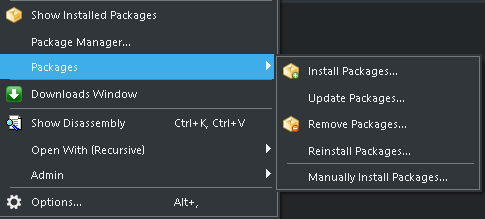

# CPU Support package for the iMXRT-Family from NXP

This CPU Support package enables the development for the iMXRT microcontroller family using the [Crossworks development environment](https://rowley.co.uk/arm/index.htm) from Rowley. The package provides all needed data and information to enabled the Development Environment to compile and debug applications on the iMXRT microcontroller
This Includes:

- CMSIS-Specific Code Files
- Memory-Map-Files
- Register-Descriptions for debugging
- Loader for programming the application to the Flash-memory

The Package is based on the [work from Rowley](https://www.rowleydownload.co.uk/arm/packages/iMXRT.htm). The original versions are included in the git-History and are tagged with a Rowley label.
This package enhances the original package by

- Using the latest CMSIS-Files and register-descriptions provided by NXP
- Enabling debugging in the external-SDRAM-memory
- Added a loader (in Source code) which supports different Flash memory targets
- Added sample code for booting from external Flash

The following Controllers are supported:

- [iMXRT1010](https://www.nxp.com/products/processors-and-microcontrollers/arm-microcontrollers/i-mx-rt-crossover-mcus/i-mx-rt1010-crossover-mcu-with-arm-cortex-m7-core:i.MX-RT1010)
- [iMXRT1015](https://www.nxp.com/products/processors-and-microcontrollers/arm-microcontrollers/i-mx-rt-crossover-mcus/i-mx-rt1015-crossover-mcu-with-arm-cortex-m7-core:i.MX-RT1015)
- [iMXRT1020](https://www.nxp.com/products/processors-and-microcontrollers/arm-microcontrollers/i-mx-rt-crossover-mcus/i-mx-rt1020-crossover-mcu-with-arm-cortex-m7-core:i.MX-RT1020)
- [iMXRT1024](https://www.nxp.com/products/processors-and-microcontrollers/arm-microcontrollers/i-mx-rt-crossover-mcus/i-mx-rt1024-crossover-mcu-with-arm-cortex-m7-core:i.MX-RT1024)
- [iMXRT1050](https://www.nxp.com/products/processors-and-microcontrollers/arm-microcontrollers/i-mx-rt-crossover-mcus/i-mx-rt1050-crossover-mcu-with-arm-cortex-m7-core:i.MX-RT1050)
- [iMXRT1060](https://www.nxp.com/products/processors-and-microcontrollers/arm-microcontrollers/i-mx-rt-crossover-mcus/i-mx-rt1060-crossover-mcu-with-arm-cortex-m7-core:i.MX-RT1060)
- [iMXRT1064](https://www.nxp.com/products/processors-and-microcontrollers/arm-microcontrollers/i-mx-rt-crossover-mcus/i-mx-rt1064-crossover-mcu-with-arm-cortex-m7-core:i.MX-RT1064)
- [iMXRT1160](https://www.nxp.com/products/processors-and-microcontrollers/arm-microcontrollers/i-mx-rt-crossover-mcus/i-mx-rt1160-crossover-high-performance-mcu-with-arm-cortex-m7-and-cortex-m4-cores:i.MX-RT1160)
- [iMXRT1170](https://www.nxp.com/products/processors-and-microcontrollers/arm-microcontrollers/i-mx-rt-crossover-mcus/i-mx-rt1170-crossover-mcu-family-first-ghz-mcu-with-arm-cortex-m7-and-cortex-m4-cores:i.MX-RT1170)

** Do not use for iMXRT1040 Controller, the QSPI-Flash of the evaluation board is not supported **

## Build and Install

The Package is provided unpacked and has to be packed before it can be installed. For this open the Project File located in the root of the project with the Crossworks IDE (File imxrt.hzp). Then “compile" it like a normal project (Build -> Build iMXRT). This will create the CPU-Support package in the root-Folder of the project (-> iMXRT.hzq).
To install the new created package, go to Tools -> Packages -> Manually Install Packages and choose the new File.
  
:grey_exclamation: Uninstall a possibly already existing iMXRT-CPU-Support package before installing the new one. The Folder Structure and the predefined macros are different, those packages are not compatible to each other. :grey_exclamation:

## The Loader

### How it works

The iMXRT is flashless, therefore you need to add external Flash to run the code from. You get Flash memory with different Interfaces (SPI, QSPI, OSPI, HyperInteface) and these interfaces speak often different dialects. To get access to those memories you need a software which configures the memory interface according the used Memory. This is done by the Loader.
The Loader is transmitted by the development Environment to the Internal-RAM of the controller and is executed there like a ‘normal’ application. After the Loader has initialized the interface, the Program Code is transmitted via the JTAG/SWD interface to the unused areas of the internal RAM and then written to the Flash memory by the Loader.
The Development-Environment instructs the Loader which interface should be used. This information is passed with the second parameter of the main function and is loaded via JTAG/SWD before executing the Loader
The following options are supported:

```C
enum MemoryType
{
    MemType_Invalid     = 0,
    MemType_Hyperflash  = 1,
    MemType_OctaSPI_DDR = 2,
    MemType_OctaSPI     = 3,
    MemType_QuadSPI_DDR = 4,
    MemType_QuadSPI     = 5,
    MemType_SPI         = 6,
};
```

The lowest Nibble of the parameter is used to configure the first FlexSPI-Interface, the next nibble for the second interface if available on the target device.

### Supported Flashes

* Adesto
  * AT25SF128A-SHB-T
  * ATXP032
* CYPRESS
  * S26KS512SDPBHI020
* Macronix
  * MX25L6433F
  * MX25UW6345G
  * MX25UM51345G
* ISSI
  * IS25LP064A-JBLE
  * IS25WP064A-JBLE
  * IS25WP128-JBLE
